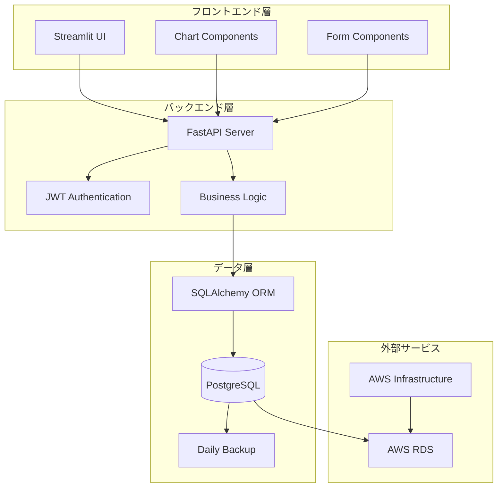

# 設計書

## 概要

サブスクリプション管理Webアプリケーションは、3層アーキテクチャを採用したモノリシックなWebアプリケーションです。フロントエンドにStreamlit、バックエンドにFastAPI、データベースにPostgreSQLを使用し、JWT認証によるセキュアなユーザー管理を実現します。

## アーキテクチャ

### システム全体構成



### 3層アーキテクチャ

1. **プレゼンテーション層 (Streamlit)**
   - ユーザーインターフェース
   - フォーム処理
   - データ可視化（グラフ、チャート）

2. **ビジネスロジック層 (FastAPI)**
   - API エンドポイント
   - 認証・認可
   - データバリデーション
   - ビジネスルール実装

3. **データアクセス層 (SQLAlchemy + PostgreSQL)**
   - データ永続化
   - クエリ最適化
   - トランザクション管理

## コンポーネントと インターフェース

### バックエンドコンポーネント

#### 1. 認証サービス (AuthService)
```python
class AuthService:
    def authenticate_user(username: str, password: str) -> Optional[User]
    def create_access_token(user_id: int, expires_delta: timedelta = timedelta(hours=24)) -> str
    def create_refresh_token(user_id: int, expires_delta: timedelta = timedelta(days=30)) -> str
    def verify_token(token: str) -> Optional[User]
    def refresh_access_token(refresh_token: str) -> Optional[str]
    def logout_user(token: str) -> bool
```

**JWTトークン設定:**
- アクセストークン有効期限: 24時間
- リフレッシュトークン有効期限: 30日
- トークンローテーション: リフレッシュ時に新しいトークンペアを発行

#### 2. サブスクリプションサービス (SubscriptionService)
```python
class SubscriptionService:
    def create_subscription(user_id: int, data: SubscriptionCreate) -> Subscription
    def get_user_subscriptions(user_id: int) -> List[Subscription]
    def update_subscription(subscription_id: int, data: SubscriptionUpdate) -> Subscription
    def delete_subscription(subscription_id: int) -> bool
    def calculate_monthly_total(user_id: int) -> Decimal
```

#### 3. ダッシュボードサービス (DashboardService)
```python
class DashboardService:
    def get_dashboard_data(user_id: int) -> DashboardData
    def get_category_breakdown(user_id: int) -> Dict[str, Decimal]
    def get_spending_trends(user_id: int, months: int = 12) -> List[MonthlySpending]
    def get_upcoming_renewals(user_id: int, days: int = 7) -> List[Subscription]
```

#### 4. 通知サービス (NotificationService)
```python
class NotificationService:
    def check_upcoming_renewals(user_id: int) -> List[RenewalNotification]
    def mark_renewal_processed(subscription_id: int) -> bool
    def calculate_next_renewal_date(subscription: Subscription) -> date
```

#### 5. ログサービス (LoggingService)
```python
class LoggingService:
    def log_error(error: Exception, context: Dict[str, Any]) -> None
    def log_user_action(user_id: int, action: str, details: Dict[str, Any]) -> None
    def upload_logs_to_s3() -> bool
    def get_log_presigned_url(log_file: str) -> str
```

### フロントエンドコンポーネント

#### 1. 認証コンポーネント
- ログインフォーム
- セッション管理
- トークン更新

#### 2. ダッシュボードコンポーネント
- 支出サマリー表示
- カテゴリ別円グラフ
- 月別支出推移グラフ
- 更新予定一覧

#### 3. サブスクリプション管理コンポーネント
- サブスクリプション一覧
- 新規登録フォーム
- 編集フォーム
- 削除確認ダイアログ

### API エンドポイント設計

#### 認証関連
- `POST /auth/login` - ユーザーログイン
- `POST /auth/logout` - ユーザーログアウト
- `POST /auth/refresh` - トークン更新

#### サブスクリプション管理
- `GET /subscriptions` - サブスクリプション一覧取得
- `POST /subscriptions` - 新規サブスクリプション作成
- `PUT /subscriptions/{id}` - サブスクリプション更新
- `DELETE /subscriptions/{id}` - サブスクリプション削除

#### ダッシュボード
- `GET /dashboard` - ダッシュボードデータ取得
- `GET /dashboard/categories` - カテゴリ別集計取得
- `GET /dashboard/trends` - 支出推移データ取得
- `GET /dashboard/renewals` - 更新予定取得

## データモデル

### ユーザーモデル
```python
class User(Base):
    __tablename__ = "users"
    
    id: int = Column(Integer, primary_key=True)
    username: str = Column(String(50), unique=True, nullable=False)
    email: str = Column(String(100), unique=True, nullable=False)
    hashed_password: str = Column(String(255), nullable=False)
    created_at: datetime = Column(DateTime, default=datetime.utcnow)
    updated_at: datetime = Column(DateTime, default=datetime.utcnow, onupdate=datetime.utcnow)
    
    subscriptions: List[Subscription] = relationship("Subscription", back_populates="user")
```

### サブスクリプションモデル
```python
class Subscription(Base):
    __tablename__ = "subscriptions"
    
    id: int = Column(Integer, primary_key=True)
    user_id: int = Column(Integer, ForeignKey("users.id"), nullable=False)
    service_name: str = Column(String(100), nullable=False)
    monthly_fee: Decimal = Column(DECIMAL(10, 2), nullable=False)
    category: str = Column(Enum(SubscriptionCategory), nullable=False)
    start_date: date = Column(Date, nullable=False)
    next_renewal_date: date = Column(Date, nullable=False)
    memo: Optional[str] = Column(Text)
    is_active: bool = Column(Boolean, default=True)
    created_at: datetime = Column(DateTime, default=datetime.utcnow)
    updated_at: datetime = Column(DateTime, default=datetime.utcnow, onupdate=datetime.utcnow)
    
    user: User = relationship("User", back_populates="subscriptions")
```

### カテゴリ列挙型
```python
class SubscriptionCategory(str, Enum):
    VIDEO_STREAMING = "動画配信"
    MUSIC = "音楽"
    GAMING = "ゲーム"
    OTHER = "その他"
```

### Pydanticスキーマ

#### リクエストスキーマ
```python
class SubscriptionCreate(BaseModel):
    service_name: str = Field(..., min_length=1, max_length=100)
    monthly_fee: Decimal = Field(..., gt=0, decimal_places=2)
    category: SubscriptionCategory
    start_date: date
    next_renewal_date: Optional[date] = None
    memo: Optional[str] = Field(None, max_length=500)

class SubscriptionUpdate(BaseModel):
    service_name: Optional[str] = Field(None, min_length=1, max_length=100)
    monthly_fee: Optional[Decimal] = Field(None, gt=0, decimal_places=2)
    category: Optional[SubscriptionCategory] = None
    start_date: Optional[date] = None
    next_renewal_date: Optional[date] = None
    memo: Optional[str] = Field(None, max_length=500)
```

#### レスポンススキーマ
```python
class SubscriptionResponse(BaseModel):
    id: int
    service_name: str
    monthly_fee: Decimal
    category: SubscriptionCategory
    start_date: date
    next_renewal_date: date
    memo: Optional[str]
    is_active: bool
    created_at: datetime
    updated_at: datetime

class DashboardData(BaseModel):
    total_monthly_expense: Decimal
    subscription_count: int
    category_breakdown: Dict[str, Decimal]
    upcoming_renewals: List[SubscriptionResponse]
    monthly_trends: List[MonthlySpending]

class MonthlySpending(BaseModel):
    year: int
    month: int
    total_amount: Decimal
```

## 正確性プロパティ

このセクションは削除されました。代わりに単体テストで具体的な例とエッジケースを検証します。

## エラーハンドリング

### エラー分類

1. **バリデーションエラー**
   - 無効な入力データ
   - 必須フィールドの欠如
   - データ型の不一致

2. **認証・認可エラー**
   - 無効な認証情報
   - 期限切れトークン
   - アクセス権限不足

3. **データベースエラー**
   - 接続失敗
   - クエリ実行エラー
   - 制約違反

4. **システムエラー**
   - 内部サーバーエラー
   - 外部サービス連携エラー
   - リソース不足

### エラーレスポンス形式

```python
class ErrorResponse(BaseModel):
    error_code: str
    message: str
    details: Optional[Dict[str, Any]] = None
    timestamp: datetime
    request_id: str
```

### エラーハンドリング戦略

1. **グレースフルデグラデーション**
   - 部分的な機能停止時も基本機能は維持
   - ユーザーに適切な代替手段を提示

2. **ログ記録**
   - すべてのエラーを構造化ログで記録
   - デバッグ情報とユーザー情報を分離
   - ログはAWS S3に保存して長期保管

3. **ユーザーフレンドリーなメッセージ**
   - 技術的詳細を隠蔽
   - 日本語での明確な説明
   - 解決方法の提示

## テスト戦略

### 単体テスト中心のアプローチ

システムの品質保証のため、単体テストを中心とした実用的なテスト戦略を採用します。

**単体テスト**:
- 具体的な例とエッジケースの検証
- コンポーネント間の統合ポイントのテスト
- エラー条件の確認
- ビジネスロジックの正確性検証

**統合テスト**:
- API エンドポイントのテスト
- データベース操作のテスト
- 認証フローのテスト

### テスト設定

**テストライブラリ**: pytest
- 各テストは具体的なシナリオを検証
- エッジケースと正常ケースの両方をカバー
- モックとフィクスチャを活用

**AWSサービスモック**: moto
- boto3を使用するコードのテスト時にmotoでAWSサービスをモック化
- RDS、S3、Lambda等のAWSリソースを仮想環境でテスト

### テストカバレッジ目標

- **単体テスト**: 90%以上のコードカバレッジ
- **統合テスト**: 主要なユーザーフローをカバー
- **セキュリティテスト**: すべてのセキュリティ要件をカバー

### テスト実行戦略

1. **開発時**: pytestで単体テストを実行
2. **CI/CD**: 全テストスイートの自動実行（pytest + coverage）
3. **AWSテスト**: motoを使用してAWSサービスをモック化
4. **リリース前**: 手動テストとパフォーマンステスト
5. **本番監視**: ヘルスチェックと可用性監視